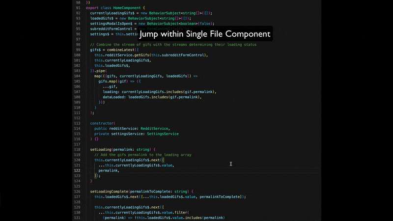

# Angular Inline Jumper

Quickly jump between your class, template, and styles in your Angular single file components!

## Default bindings:

- Template: (alt/option)+T
- Styles: (alt/option)+S
- Class: (alt/option)+C

## Release Notes

### 1.1.0

- Jumping will now scroll as much of the relevant section (i.e. template/style/class) into view as possible. For example, previously if you cursor was above `styles` and `styles` as off screen, jumping to `styles` would just jump the cursor to the `styles` property, but you would still have to scroll down to see the styles. This change fixes that.

### 1.0.0

- Changed default keybinding
- Added logo

### 0.0.1

Initial release
